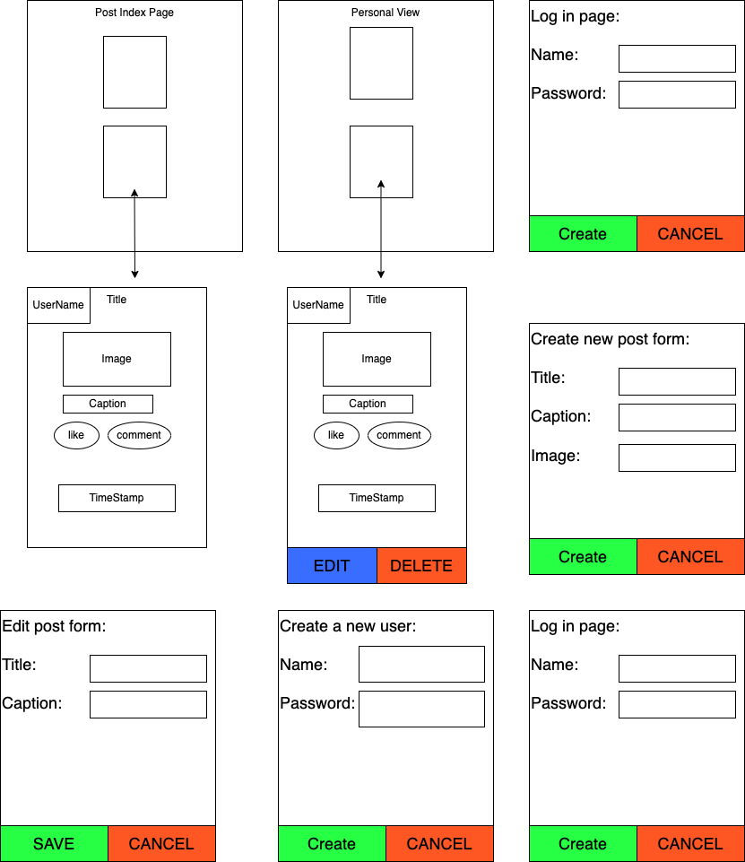

# [React Chakra Introduction](https://blog.appseed.us/chakra-ui-react-coding-landing-page/)

Sample Code for the blog article [React Chakra UI Components - Learn by Coding](https://blog.appseed.us/chakra-ui-react-coding-landing-page/) - Provided by `AppSeed`.

The article explains how to use the Chakra UI library in React.js by building a responsive website. The website will be built with Chakra components only, no HTML element will be used.

- 👉 [React Chakra Landing Page](https://react-chakra-ui-landing-page.appseed-srv1.com/) - LIVE Demo
- 👉 [React Apps](https://appseed.us/apps/react) - index provided by `AppSeed`

 

 

## How to use it 

- Install `NodejS` - version 14.x or higher 
- Install dependencies via `yarn`
- Start the project: `yarn start` 

 

## Components

- `Header` 
- `Hero`
- `Info Section`
- `AboutUs`
- `Testimonial`
- `ContactUs`
- `Footer`   

 

## What is React.js

React.js is a JavaScript library that allows you to build fast and efficient web applications using the minimum amount of code possible. In React.js, you can break the web layout into components - reusable bits of code that return HTML elements. 

- 👉 [JavaScript concepts for React Beginners](https://blog.appseed.us/10-javascript-concepts-for-react-beginners/)

 

## Chakra UI Library 

Chakra UI is a library that allows you to build stunning and modern web applications using various layout components. It differs from other UI frameworks in that it offers accessibility and dark mode support by default. 

With Chakra UI, you spend less time building responsive and beautiful websites. If you want to create a web application that allows users to switch between different color modes with minimal lines of code, then Chakra UI is an excellent choice.

- 👉 [Chakra UI](https://chakra-ui.com/) - official website  

 

--- 
[React Chakra Introduction](https://blog.appseed.us/chakra-ui-react-coding-landing-page/) - provided by AppSeed 

# Spotlight API Project 
A social media app that allow users to "SPOTLIGHT" a major current event, a special moment of their day, or just an image that provided a fleeting moment of joy and share it with others.

## User Story
- As an unregistered user, I would like to view all images
- As an unregistered user, I would like to sign up with email and password.
- As a registered user, I would like to sign in with email and password.
- As a signed in user, I would like to change password.
- As a signed in user, I would like to sign out.
- As a signed in user, I would like to upload an image to AWS with a name
- As a signed in user, I would like to update the name of my image on AWS.
- As a signed in user, I would like to see all my images on AWS.
- As a signed in user, I would like to see the thumbnail of all images on AWS.
- As a signed in user, I would like to comment on posts
- As a signed in user, I would like to delete my comments
- As a signed in user, I would like to update my comments
- As a signed in user, I would like to delete the reference of my image from the database.
- As a signed in user, I would like to see the following data for any post:
    - date created/uploaded
    - date modified
    - owner (user who created the post)
    - name

### Stretch Goals
- As an unregistered user, I would like to download any image
- As a signed in user, I would like to 'like' images
- As a signed in user, i would like to follow another user
- As a signed in user, i would like to share another user's post

## Technology
We will be using React for our front end with RESTful routes and Moongose Express for our back end with CRUD actions. The app will use AWS to store the uploaded images, MongoDB Atlas as the database, and Heroku to launch.

## Wireframes

## Development Roles 
- Front-End SME: Trevor Zou
- Back-End SME: Shai Aloni 
- Team Manager: Dang Do